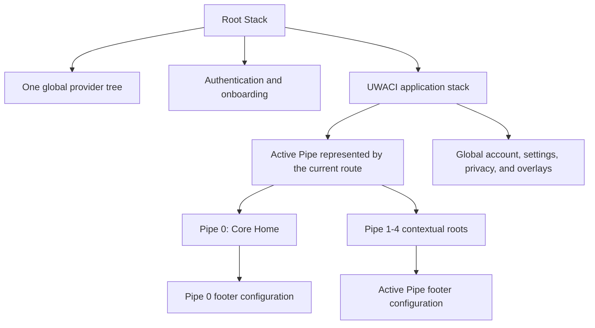

# Navigation architecture

## Current implementation audit

UWACI uses Expo Router `~57.0.14` (React Navigation through file-based routes). `app/_layout.tsx` is the root stack and installs the single global provider tree. `(auth)` and `(app)` are separate stack groups; onboarding sits at the root. The main application group contains Core Home, conversations, library screens, account/settings, the Pipe selector, and contextual Pipe routes. The `uwaci://` scheme is declared in `app.json`; there is no separate custom linking table.

The application does not use a React Navigation `Tabs` navigator. It uses the shared custom `BottomTabBar`, which now reads a typed Pipe registry. Route parameters remain typed at route boundaries through Expo Router's `Href` and `useLocalSearchParams`. Redux owns session, preferences, conversation, voice, and network state; it deliberately does not duplicate the active Pipe.

## App shell and Pipe model

A Pipe is a contextual UWACI product experience, not an isolated application. Authentication, session state, API clients, localization, theme, persistence, network state, notifications, and shared UI remain in the root app shell.

Pipe 0 is special: it is the neutral Core/Home context and the default destination after normal application entry. Selecting Home from any other Pipe switches to Pipe 0 rather than rendering a duplicate Home screen.

## Source of truth and switching

The active Pipe is represented by the mounted Expo Router route:

- `/(app)` is Pipe 0.
- `/(app)/pipe/[pipeId]` is a contextual Pipe.
- Menu receives `fromPipe` only to keep the originating contextual footer visible while choosing another Pipe.

This avoids mirroring navigation state in Redux. Normal nested navigation therefore cannot drift from the footer state, and device Back follows the real route history rather than numerical Pipe order.

Pipe identifiers, default routes, and footer items live in:

- `src/application/navigation/pipes/pipe.types.ts`
- `src/application/navigation/pipes/pipe.config.ts`
- `src/application/navigation/pipes/usePipeNavigation.ts`

Screens call `switchPipe`, `navigateToPipe`, or `openMenu` instead of scattering cross-Pipe route strings. Pipe-internal routes can extend the typed `CrossPipeNavigationTarget` as approved product screens are added.

## Dynamic footer

`BottomTabBar` receives the active item and Pipe ID, then renders that Pipe's registry entry. Pipe 0 uses the existing Core destinations. Pipes 1-4 intentionally expose only Home, their contextual root, and Menu until product owners define real tab names and routes. This establishes the architecture without inventing business functionality.

Home is an action for non-Core Pipes: it switches to Pipe 0. Menu opens the shared Pipe selector while preserving the originating Pipe for footer rendering. Account and settings remain global routes and are not duplicated per Pipe.

## Adding another Pipe

1. Add the identifier to `PipeId`.
2. Register its label, default typed route, and footer items in `PIPE_NAVIGATION_CONFIG`.
3. Add or extend its Expo Router route and feature screen.
4. Extend `CrossPipeNavigationTarget` only for approved cross-Pipe entry points.
5. Add English/French labels and registry/navigation tests.

Root navigation and the global provider tree should not need to change.

## Route ownership

Route files validate parameters and render feature screens. Recorder logic, API calls, reducers, and domain transformations stay in feature/application modules. Global account/privacy/settings routes belong in `(app)` but outside a Pipe module. Pipe-specific nested routes belong under the relevant contextual route boundary.

Authentication behavior remains at the existing root/auth boundary. Protected API actions still require a restored session and redirect to sign-in with their intended destination. Pipe selection is not initialized for unauthenticated routes.
